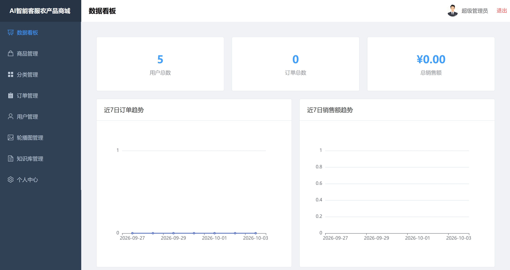
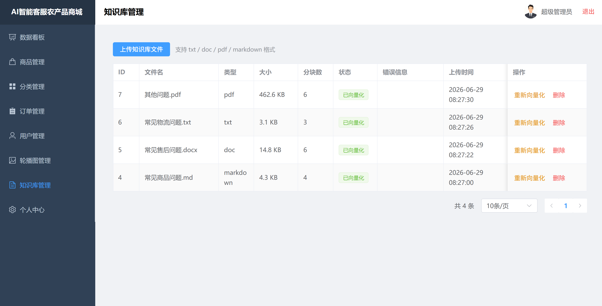
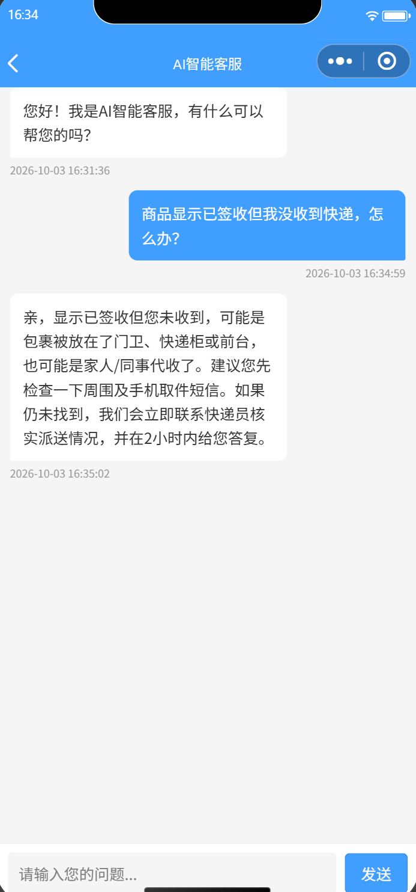

# 基于 LangChain RAG 的智能客服农产品微信小程序商城

一个带 **AI 智能客服**（LangChain RAG 知识增强问答）的农产品电商系统，共三端：

| 端 | 技术栈 | 路径 |
|----|--------|------|
| 后端 API | Python · FastAPI · SQLAlchemy · LangChain · FAISS | [`server/`](server) |
| 管理后台 | Vue3 · Vite · Element Plus · Pinia · ECharts | [`client/`](client) |
| 微信小程序 | 原生小程序 | [`weixin/`](weixin) |

**AI 客服链路**：用户提问 → 阿里云 `text-embedding-v4` 向量化 → FAISS 语义检索知识库 → DeepSeek `deepseek-chat` 结合检索结果生成回答。

## 功能特性

- 🛍️ **商城**：商品、分类、轮播图、购物车、订单、收货地址
- 🤖 **AI 智能客服**：基于知识库的 RAG 问答，支持 txt / docx / pdf / markdown 知识文件
- 📚 **知识库管理**：后台上传、解析、向量化知识文件
- 👥 **双端用户体系**：管理员（后台）+ 用户（小程序），JWT 认证

## 界面预览

**管理后台 · 数据看板**



**管理后台 · 知识库管理**（上传知识文件 → 向量化）



**微信小程序 · AI 智能客服（RAG 问答）**



## 目录结构

```
ai-shop/
├── server/          # 后端（FastAPI + LangChain RAG）
│   ├── routers/     # 各业务路由
│   ├── services/    # AI 客服、向量库、文件解析等服务
│   ├── models/      # SQLAlchemy 模型
│   ├── config.py    # 配置（读 .env）
│   └── .env.example # 配置模板
├── client/          # 管理后台（Vue3）
├── weixin/          # 微信小程序
├── db/              # 数据库脚本 db_ai_shop.sql
└── uploads/         # 上传目录（knowledge/ 为示例知识库）
```

## 快速开始（本地）

### 1. 环境要求

| 软件 | 版本 |
|------|------|
| Python | 3.11+ |
| Node.js | 20+ |
| MySQL | 8.0+ |

### 2. 数据库

```sql
CREATE DATABASE db_ai_shop CHARACTER SET utf8mb4 COLLATE utf8mb4_unicode_ci;
```

导入建库脚本（含表结构与种子数据）：

```bash
mysql -uroot -p db_ai_shop < db/db_ai_shop.sql
```

### 3. 后端

```bash
cd server
python -m venv venv

# Windows
venv\Scripts\pip install -r requirements.txt
# Linux / macOS
venv/bin/pip install -r requirements.txt

# 配置密钥
cp .env.example .env   # 然后编辑 .env 填入数据库连接与 AI 密钥

# 启动
venv\Scripts\python -m uvicorn main:app --host 0.0.0.0 --port 8000
```

启动后：
- 后端 API：http://localhost:8000
- 接口文档：http://localhost:8000/docs

### 4. 前端管理后台

```bash
cd client
npm install
npm run dev        # http://localhost:5173
```

（Vite 已配置将 `/api` 代理到 `http://127.0.0.1:8000`）

### 5. 微信小程序

1. 打开「微信开发者工具」→「导入项目」→ 选择 `weixin/` 目录
2. AppID 选择「测试号」
3. 右上角「详情」→「本地设置」→ 勾选「**不校验合法域名**」（否则连不上本地后端）

## 配置说明

编辑 `server/.env`（模板见 `server/.env.example`）：

| 变量 | 说明 |
|------|------|
| `DATABASE_URL` | MySQL 连接串 |
| `SECRET_KEY` | JWT 密钥 |
| `UPLOAD_DIR` | 文件上传目录（绝对路径） |
| `DEEPSEEK_API_KEY` | DeepSeek 对话模型密钥 |
| `DEEPSEEK_BASE_URL` | `https://api.deepseek.com` |
| `CHAT_MODEL` | `deepseek-chat` |
| `EMBEDDING_API_KEY` | 阿里云百炼 Embedding 密钥 |
| `EMBEDDING_BASE_URL` | `https://dashscope.aliyuncs.com/compatible-mode/v1` |
| `EMBEDDING_MODEL` | `text-embedding-v4`（2048 维） |
| `RAG_TOP_K` | RAG 检索返回条数 |
| `CHUNK_SIZE` / `CHUNK_OVERLAP` | 文本分块参数 |

## 登录账号（种子数据）

| 端 | 账号 | 密码 |
|----|------|------|
| 管理后台 | `admin` | `12345678` |
| 小程序 | `user001` | `123456` |

## 向量库说明

- 向量库使用 **FAISS**，持久化在 `server/vector_store/`（该目录已 gitignore，克隆后需重建）
- 示例知识库文件位于 `uploads/knowledge/`，通过后台「知识库管理」上传/重新向量化即可生成向量索引
- 更换 Embedding 模型需**重建向量库**（向量维度/语义空间不同）
